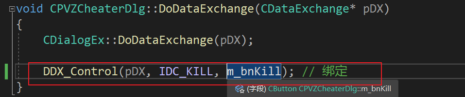
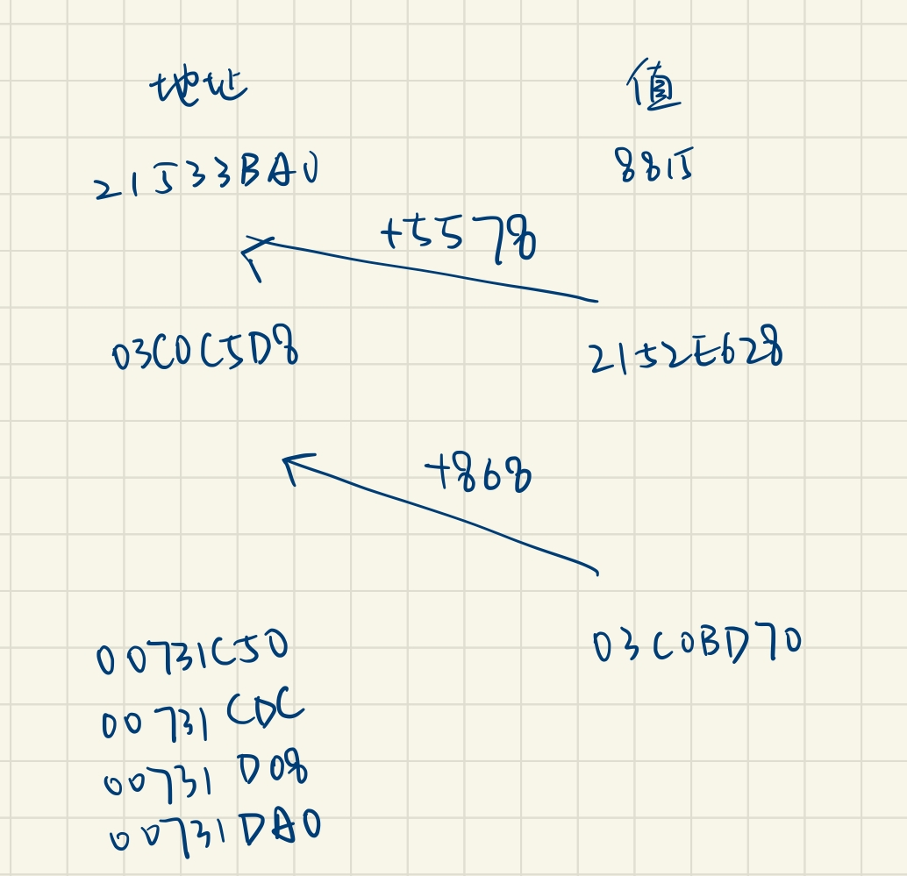

# PVZCheater
# PVZCheater

## MFC

1. 创建MFC项目
2. 拖放组件，比如button
3. 在Dlg.cpp和Dlg.h里面声明定义函数，在BEGING END的MAP里将函数和视图按钮绑定
4. 输出不能用cout，用TRACE（只能在F5debug模式下看到）或者AfxMessageBox（弹框）或者MessageBox

    1. F9加断点
    2. 编写宏来简化输出过程
5. 绑定控件

    1. 
6. 添加变量

## 破解

1. Windows: PE
2. Linux: ELF
3. Mac(iOS): Mach-O

代码段、数据段、堆空间、栈空间等等这些排列顺序根据文件格式固定

工具：Ollydbg，简称OD；CE

## 大致流程

根据需要修改的内容，修改进程内存地址的值，或者更改汇编代码

1. 秒杀僵尸

    1. 用CE捕捉修改普通僵尸血量的语句
    2. 思索如何替换——修改汇编代码，少的字节用nop（90）替代

        ```x86asm
        popcapgame1.exe+145DFA - 2B 6C 24 20           - sub ebp,[esp+20]

        popcapgame1.exe+145DFA - 29 ED                 - sub ebp,ebp
        popcapgame1.exe+145DFC - 90                    - nop 
        popcapgame1.exe+145DFD - 90                    - nop 
        ```
    3. 写到MFC里
2. 无限阳光

    1. 阳光是一个被间接指向的值，用CE的功能“查看是谁修改”一直溯源直到找到绿色的静态基址

        1. 发现是这样的，0x00731c50-0x00731DA0存静态基址，横线上是我减出来的offset

            ​
        2. 将需要的阳光值，例如9990，根据基址和相对offset存进去
        3. 写到MFC里
